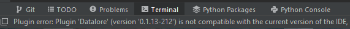

# AtelierVisualisation
Exercices de visualisation réalisées dans le cadre du ProgFest 2022.
# Installation et mise en route
1. Avec la fonction `Fork` de GitHub, ajoutez ce répertoire à vos répertoires.
2. Clonez votre nouveau répertoire.
3. Pour ceux qui ne savent pas comment installer des *packages* **OU** travailler avec un jupyter notebook, suivez les instructions suivantes :
   1. Une fois le répertoire sur votre ordinateur, ouvrez le avec pycharm (clic droit dans le dossier et appuyez sur ouvrir avec pycharm).
   2. Créez-vous un environnement virtuel (idéalement en python 3.9)
      1. Ceux qui ne maîtrisent pas cette dernière étape pouvez demander de l'aide ou travailler dans l'environnement de base.
   3. Rendez-vous dans le bas à gauche de l'interface de pycharm et cliquez sur `Terminal` (voir figure ci-dessous) 
   4. Dans le terminal, vous devriez être automatiquement dans l'environnement virtuel. Simplement entrez la commande suivante : `pip install -r requirements.txt` pour installer les librairies nécessaires.
   5. Jupyter notebook devrait être maintenant installé. Toujours dans le terminal, entrez la commande `jupyter notebook`.
4. Patientez quelques secondes et le *notebook* devrait ouvrir dans votre navigateur préféré.
5. Rendez-vous dans le dossier src sur la page du notebook et cliquez sur `Exercices de visualisation.ipynb` pour commencer l'exercice.
6. Lorsque vous aurez terminé, simplement sauvegarder votre progrès et, dans `Files`, cliquez sur *close and halt*, puis faites `ctrl + c` dans le terminal pour stopper le *notebook*.